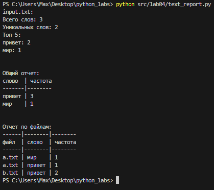
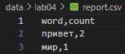
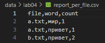
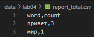

# python_labs

## Лабораторная номер 1

Задание 1
```python
print(f"Привет, {input("Имя: ")}! Через год тебе будет {int(input("Возраст: ")) + 1}.")
```


Задание 2
```python
num_1 = input()
num_1 = float(num_1.replace(",","."))
num_2 = float(input())
print(f"sum={num_1 + num_2}; avg={((num_1 + num_2)/2):.2f}")
```


Задание 3
```python
price = float(input("price= "))
discount = float(input("discount= "))
vat = float(input("vat= "))
base = price * (1 - discount/100)
vat_amount = base * (vat/100)
total = base + vat_amount
print(f"База после скидки: {base:.2f} ₽\nНДС: {vat_amount:.2f} ₽\nИтого к оплате: {total:.2f} ₽")
```


Задание 4
```python
min = int(input("Минуты: "))
print(f"{min//60}:{min%60}")
```


Задание 5
```python
name = " ".join(input("ФИО:").split())
full_name = ""
for i in name:
    if i.isupper():
        full_name += i
print(f"Инициалы: {full_name}. \nДлина (символов): {len(name)}")
```


Задание 6
```python
def solve():
    true_count = 0
    false_count = 0
    n = int(input())

    for i in range(n):
        line = input().split()
        counter = line[-1]

        if counter == "True":
            true_count += 1
        elif counter == "False":
            false_count += 1

    return print(true_count, false_count)

solve()
```


Задание 7
```python
def find_word(test):
    end = ""
    count_1 = 0
    count_2 = 0
    for i in test:
        count_1 += 1
        if i.isupper():
            end += i
            break
    
    for i in test:
        count_2 += 1
        if i.isdigit():
            break
    
    end += test[count_2::count_2 - count_1 + 1]
    return end

test = input()
print(find_word(test))
```


## Лабораторная номер 2

Задание 1
```python
def min_max(nums: list[float | int]) -> tuple[float | int, float | int]:
    """Возвращает кортеж (минимум, максимум). Если список пуст — ValueError"""
    
    if len(nums) == 0:
        raise ValueError("Список пуст")
    
    else:
        return (min(nums),max(nums))
try:
    print("min_max")
    print("Тест 1:", min_max([3, -1, 5, 5, 0]))
    print("Тест 2:", min_max([42]))
    print("Тест 3:", min_max([-5, -2, -9]))
    print("Тест 4:", min_max([1.5, 2, 2.0, -3.1]))
    print("Тест 5:", min_max([]))
except ValueError as e:
    print(f"Ошибка: {e}")


def unique_sorted(nums: list[float | int]) -> list[float | int]:
    """Возвращает отсортированный список уникальных значений (по возрастанию)"""
    return list(sorted(set(nums)))

print(f"\nunique_sorted")
print("Тест 1:", unique_sorted([3, 1, 2, 1, 3]))
print("Тест 2:", unique_sorted([]))
print("Тест 3:", unique_sorted([-1, -1, 0, 2, 2]))
print("Тест 4:", unique_sorted([1.0, 1, 2.5, 2.5, 0]))


def flatten(mat: list[list | tuple]) -> list:
    """«Расплющивает» список списков/кортежей в один список по строкам (row-major).
    Если встретилась строка/элемент, который не является списком/кортежем — TypeError"""
    result = []

    for i in mat:
        if not isinstance(i, (list, tuple)):
            raise TypeError("строка не строка строк матрицы")
        result.extend(i)    
    
    return result

try:
    print(f"\nflatten")
    print("Тест 1:", flatten([[1, 2], [3, 4]]))
    print("Тест 2:", flatten([[1, 2], (3, 4, 5)]))
    print("Тест 3:", flatten([[1], [], [2, 3]]))
    print("Тест 4:", flatten([[1, 2], "ab"]))
except TypeError as e:
    print(f"Ошибка: {e}")
```


Задание B
```python
def check_rectangular(matrix):
    """Проверяет, что матрица прямоугольная"""
    if not matrix:
        return
    first_len = len(matrix[0])
    for row in matrix:
        if len(row) != first_len:
            return False

def transpose(mat: list[list[float | int]]) -> list[list]:
    """Транспонирование матрицы (Меняем строки и столбцы местами)"""
    if check_rectangular(mat) == False:
        raise ValueError("Рваная матрица")

    if not mat:
        return []
    return [list(item) for item in zip(*mat)]

try:
    print(f"\ntranspose")    
    print("Тест 1:", transpose([[1, 2, 3]]))
    print("Тест 2:", transpose([[1], [2], [3]]))
    print("Тест 3:", transpose([[1, 2], [3, 4]]))
    print("Тест 4:", transpose([]))    
    print("Тест 5:", transpose([[1, 2], [3]])) 
except ValueError as e:
    print(f"Ошибка: {e}")

def row_sums(mat: list[list[float | int]]) -> list[float]:
    """Возвращает суммы элементов каждой строки матрицы"""
    if check_rectangular(mat) == False:
        raise ValueError("Рваная матрица")
    
    return [sum(item) for item in mat]

try:
    print(f"\nrow_sumse")    
    print("Тест 1:", row_sums([[1, 2, 3], [4, 5, 6]]))
    print("Тест 2:", row_sums([[-1, 1], [10, -10]]))
    print("Тест 3:", row_sums([[0, 0], [0, 0]]))    
    print("Тест 4:", row_sums([[1, 2], [3]])) 
except ValueError as e:
    print(f"Ошибка: {e}")

def col_sums(mat: list[list[float | int]]) -> list[float]:
    """Возвращает суммы элементов каждого столбца матрицы"""
    if check_rectangular(mat) == False:
        raise ValueError("Рваная матрица")
    
    return [sum(item) for item in zip(*mat)]

try:
    print(f"\ncol_sums")    
    print("Тест 1:", col_sums([[1, 2, 3], [4, 5, 6]]))
    print("Тест 2:", col_sums([[-1, 1], [10, -10]]))
    print("Тест 3:", col_sums([[0, 0], [0, 0]]))    
    print("Тест 4:", col_sums([[1, 2], [3]])) 
except ValueError as e:
    print(f"Ошибка: {e}")
```


Задание C
```python
def format_record(rec: tuple[str, str, float]) -> str:
    """ Форматирует запись о студенте в стандартизированную строку."""

    if not isinstance(rec, tuple):
        raise ValueError("входные данные должны быть tuple")
    elif len(rec) != 3:
        raise ValueError("tuple должен содержать ровно 3 элемента")

    result = []

    if len(rec[0]) == 0:
        raise ValueError("пустое ФИО") 
    elif len(rec[1]) == 0:
        raise ValueError("пустая группа")
    elif not isinstance(rec[2], float):
        raise ValueError("неверный тип GPA") 
    
    full_name = ((rec[0].strip()).title()).split()
    full_name_abbrevition = [str(x) for x in " ".join(full_name) if x.isupper()]
    result.append(f"{full_name[0]} {".".join(full_name_abbrevition[1:])}.")
    result.append(f"гр. {rec[1]}")
    result.append(f"GPA {rec[2]:.2f}")

    return ", ".join(result)

try:
    print("Тест 1:", format_record(("Иванов Иван Иванович", "BIVT-25", 4.6)))
    print("Тест 2:", format_record(("Петров Пётр", "IKBO-12", 5.0)))
    print("Тест 3:", format_record(("Петров Пётр Петрович", "IKBO-12", 5.0)))
    print("Тест 4:", format_record(("  сидорова  анна   сергеевна ", "ABB-01", 3.999)))
    print("Тест 5:", format_record(("сидорова  анна   сергеевна ", "", 3.999)))

except ValueError as e:
     print(f"Ошибка {e}")
```


## Лабораторная номер 3

- [Лабораторная 3 (ссылка на подробный README)](./src/lab03/README.md)

Задание A
```python
def normalize(text: str, *, casefold: bool = True, yo2e: bool = True) -> str:
    """
    Нормализует текст путем удаления специальных символов и приведения к единому формату.
    
    Функция выполняет следующие преобразования:
    - Удаляет символы табуляции (\t) и переноса строки (\n)
    - Убирает лишние пробелы (в начале, конце и множественные внутри строки)
    - При необходимости приводит текст к нижнему регистру с использованием casefold()
    - Заменяет букву 'ё' на 'е' (опционально)

    Examples:
        normalize("ПрИвЕт\nМИр\t") == "привет мир"
        normalize("ёжик, Ёлка") == "ежик, елка"
    """

    if not isinstance(text, str):
        raise ValueError("normalize: text не str")
    
    if len(text) == 0:
        raise ValueError("normalize: пустой text")

    result = (((text.replace("\t"," ")).replace("\r"," ")).replace("\n"," "))
    result = " ".join((result.strip()).split())

    if casefold:
        result = result.casefold()

    if yo2e:
        result = result.replace('ё', 'е')

    return result

def tokenize(text: str) -> list[str]:
    """
    Функция разделяет входную строку на части, используя в качестве разделителей
    любые символы, которые не являются буквами или цифрами.

    Examples:
        tokenize("привет, мир!") == ["привет", "мир"]
        tokenize("по-настоящему круто") == ["по-настоящему", "круто"]
        tokenize("2025 год") == ["2025", "год"]
    """
    import re

    if not isinstance(text, str):
        raise ValueError("tokenize: text не str")
    
    if len(text) == 0:
        raise ValueError("tokenize: пустой text")
    
    split_result = re.split(r"[^\w-]+", text)
    
    return [item for item in split_result if len(item) >= 1]
    

def count_freq(tokens: list[str]) -> dict[str, int]:
    """
    Подсчитывает частоту встречаемости слов в списке токенов.

    Examples:
        count_freq(["a","b","a","c","b","a"]) == {"a":3, "b":2, "c":1}
        count_freq(["bb","aa","bb","aa","cc"]) == {"aa":2, "bb":2, "cc":1}
    """
    from collections import Counter

    if not isinstance(tokens, list):
        raise ValueError("tokenize: text не str")
    
    if len(tokens) == 0:
        raise ValueError("count_freq: пустой tokens")

    return dict(sorted(Counter(tokens).items(), key=lambda item: (-item[1], item[0])))

def top_n(freq: dict[str, int], n: int = 5) -> list[tuple[str, int]]:
    """
    Возвращает топ-N самых частых слов с сортировкой по убыванию частоты.

    Examples:
        top_n({"a":3, "b":2, "c":1}, 2) == [("a",3), ("b",2)]
        top_n({"aa":2, "bb":2, "cc":1}, 2) == [("aa",2), ("bb",2)]
    """

    if not isinstance(freq, dict):
        raise ValueError("top_n: freq не  dict")
    
    if len(freq) == 0:
        raise ValueError("top_n: пустой freq")
    
    return sorted(freq.items(), key=lambda item: (-item[1], item[0]))[:n]
```


Задание B★
```python
import sys
import os
sys.path.append(os.path.join(os.path.dirname(__file__), '..'))

from lib.text import *

# Флаг для включения/выключения табличного режима
# True - табличный вывод, False - простой список
TABLE_MODE = True

def print_table(words_data: list[tuple[str, int]]) -> None:
    """
    Выводит форматированную таблицу слов и их частот в отсортированном виде.
    
    Функция принимает список кортежей (слово, частота) и выводит их в виде
    читаемой таблицы с выравниванием колонок. Ширина первой колонки автоматически
    подстраивается под самое длинное слово в данных или заголовке.
    """
    if not words_data:
        raise ValueError("print_table: words_data пуст")
    
    max_word_length = max(len(word) for word, count in words_data)

    if len("слово") > max_word_length:
        max_word_length = len("слово")
    
    print(f"{'слово':<{max_word_length}} | частота")
    print("-" * max_word_length + "-|-" + "-" * 7)
    
    for word, count in words_data:
        print(f"{word:<{max_word_length}} | {count}")

def print_simple(words_data: list[tuple[str, int]]) -> None:
    """
    Выводит список слов и их частот в простом формате.
    
    Функция принимает список кортежей (слово, частота) и выводит их
    в виде простого списка без форматирования таблицы.
    """
    if not words_data:
        raise ValueError("print_simple: words_data пуст")
    
    for word, count in words_data:
        print(f"{word}: {count}")

try:
    inpt_text = input("Введите текст: ")
    normalize_text = normalize(inpt_text)
    tokens = tokenize(normalize_text)
    freq = count_freq(tokens)
    top_words = top_n(freq, 5)

    print(f"Всего слов: {len(tokens)}")
    print(f"Уникальных слов: {len(freq)}")

    print("Топ-5:")
    if TABLE_MODE:
        print_table(top_words)
    else:
        print_simple(top_words)

except ValueError as e:
    print(f"Ошибка: {e}")
```


# Лабораторная работа 4: Работа с файлами и CSV

## Задание

### Часть A: Функции для работы с файлами

#### 1. ensure_parent_dir(path)
Создает родительские директории для указанного пути, если они не существуют.

```python
def ensure_parent_dir(path: str | Path) -> None:
    """
    Создать родительские директории для указанного пути, если они не существуют.
    """
    p = Path(path)
    p.parent.mkdir(parents=True, exist_ok=True)
```

**Особенности реализации:**
- Использует `pathlib.Path` для кроссплатформенной работы с путями
- `parents=True` - создает все промежуточные директории
- `exist_ok=True` - не вызывает ошибку, если директория уже существует

#### 2. read_text(path, encoding)
Читает текстовый файл целиком и возвращает его содержимое как строку.

```python
def read_text(path: str | Path, encoding: str = "utf-8") -> str:
    """
    Прочитать файл целиком и вернуть его содержимое как одну строку.

    Параметры:
        path: Путь к файлу (str или Path).
        encoding: Кодировка чтения (по умолчанию "utf-8").
            Распространенные варианты кодировок: 
                - 'utf-8' (стандартная)
                - 'cp1251', 'windows-1251' (русская Windows)
                - 'koi8-r' (русская KOI8)
                - 'latin-1', 'iso-8859-1' (западноевропейская)

    Исключения не перехватываются специально: FileNotFoundError и
    UnicodeDecodeError позволяют пользователю понять проблему напрямую.
    """
    if not isinstance(path, (str, Path)):
        raise TypeError("path должен быть str или Path")
    if not isinstance(encoding, str) or not encoding:
        raise TypeError("encoding должен быть непустой строкой")

    p = Path(path)
    with p.open("r", encoding=encoding) as file:
        return file.read()
```

**Особенности реализации:**
- Поддержка различных кодировок для работы с русскими текстами
- Автоматическое управление ресурсами через `with`
- Строгая проверка типов входных параметров
- Проброс исключений для диагностики проблем

#### 3. write_csv(rows, path, header)
Создает CSV-файл с разделителем "," и проверкой целостности данных.

```python
def write_csv(
    rows: Iterable[Sequence],
    path: str | Path,
    header: tuple[str, ...] | None = None,
) -> None:
    """
    Создать/перезаписать CSV с разделителем ",".

    - Если передан `header`, записать его первой строкой.
    - Проверить, что все строки в `rows` имеют одинаковую длину; иначе ValueError.
    - Если `rows` пустой и `header` не задан, создать пустой файл.
    - Родительские директории создаются автоматически.
    """
    if not isinstance(path, (str, Path)):
        raise TypeError("path должен быть str или Path")
    if header is not None and not isinstance(header, tuple):
        raise TypeError("header должен быть tuple или None")

    p = Path(path)
    ensure_parent_dir(p)

    rows_list = list(rows)

    if rows_list:
        row_length = len(rows_list[0])
        for row in rows_list:
            if len(row) != row_length:
                raise ValueError("все строки в rows должны иметь одинаковую длину")
    if header is not None and rows_list and len(header) != row_length:
        raise ValueError("длина header должна совпадать с длиной строк в rows")

    with p.open("w", newline="", encoding="utf-8") as file:
        writer = csv.writer(file, delimiter=",")
        if header is not None:
            writer.writerow(header)
        for row in rows_list:
            writer.writerow(row)
```

**Особенности реализации:**
- Проверка целостности данных (одинаковая длина всех строк)
- Автоматическое создание родительских директорий
- Поддержка заголовков CSV
- Использование стандартного модуля `csv` для корректного экранирования
- `newline=""` предотвращает дублирование переносов строк

### Часть B: Система отчетов по анализу текста

#### Описание системы
Создана комплексная система для анализа текстовых файлов с генерацией отчетов в различных форматах:

1. **Анализ одиночного файла** (`input.txt`) → `report.csv`
2. **Анализ множественных файлов** (`a.txt`, `b.txt`) → `report_per_file.csv`
3. **Сводный отчет** по всем файлам → `report_total.csv`

#### Реализация системы отчетов

```python
from io_txt_csv import *
import sys
import os
sys.path.append(os.path.join(os.path.dirname(__file__), '..'))
from lib.text import *

# читаем и обрабатываем первый файл
if len(read_text("data/lab04/input.txt")) == 0:
    write_csv([], "data/lab04/report.csv", header=("word", "count"))
else:
    text_1 = normalize(read_text("data/lab04/input.txt"))
    token_text_1 = tokenize(text_1)
    num_tokens_1 = count_freq(token_text_1)
    top_tokens_1 = top_n(num_tokens_1, 5)

    print("input.txt:")
    print(f"Всего слов: {len(token_text_1)}")
    print(f"Уникальных слов: {len(num_tokens_1)}")
    print("Топ-5:")
    for word, count in top_tokens_1:
        print(f"{word}: {count}")
    print("\n")

    write_csv([(word, count) for word, count in num_tokens_1.items()], 
              "data/lab04/report.csv", header=("word", "count"))

# читаем и обрабатываем несколько входных файлов + «сводный» отчет
text_2 = normalize(read_text("data/lab04/a.txt"))
token_text_2 = tokenize(text_2)
num_tokens_2 = count_freq(token_text_2)

text_3 = normalize(read_text("data/lab04/b.txt"))
token_text_3 = tokenize(text_3)
num_tokens_3 = count_freq(token_text_3)


report_per_file = {
    "a.txt": [(word, count) for word, count in num_tokens_2.items()],
    "b.txt": [(word, count) for word, count in num_tokens_3.items()]
}


report_total = count_freq(token_text_2 + token_text_3)
report_total_list = [(word, count) for word, count in report_total.items()]

# записываем отчет по файлам
write_csv([(file, word, count) for file, words in report_per_file.items() 
           for word, count in words], 
          "data/lab04/report_per_file.csv", header=("file", "word", "count"))

# записываем общий отчет
write_csv([(word, count) for word, count in report_total.items()], 
          "data/lab04/report_total.csv", header=("word", "count"))

# выводим красивый отчет в табличном виде
print("Общий отчет:")
print_table(report_total_list)
print("\n")

print("Отчет по файлам:")
print_table_per_file(report_per_file)
```

#### Дополнительные функции для вывода

```python
def print_table_per_file(words_data: dict[str, list[tuple[str, int]]]) -> None:
    """
    Выводит форматированную таблицу слов и их частот в отсортированном виде для каждого файла.
    """
    if not words_data:
        raise ValueError("print_table_per_file: words_data пуст")
    
    max_word_length = max(len(word) for file, words in words_data.items() 
                         for word, count in words)
    max_file_length = max(len(file) for file, words in words_data.items())

    if len("слово") > max_word_length:
        max_word_length = len("слово")
    
    if len("файл") > max_file_length:
        max_file_length = len("файл")
    
    print("-" * max_file_length + "-|-" + "-" * max_word_length + "-|-" + "-" * len("частота"))
    print(f"{'файл':<{max_file_length}} | {'слово':^{max_word_length}} | {'частота'}")
    print("-" * max_file_length + "-|-" + "-" * max_word_length + "-|-" + "-" * len("частота"))
    
    for file, words in words_data.items():
        for word, count in words:
            print(f"{file:<{max_file_length}} | {word:<{max_word_length}} | {count}")
```

## Тест-кейсы и краевые случаи

### 1. Обработка пустых файлов
```python
# Пустой файл input.txt
if len(read_text("data/lab04/input.txt")) == 0:
    write_csv([], "data/lab04/report.csv", header=("word", "count"))
```
**Результат:** Создается пустой CSV с заголовком.

### 2. Обработка различных кодировок
```python
# UTF-8 (по умолчанию)
content = read_text("file.txt")

# Windows-1251 для русских файлов
content = read_text("file.txt", encoding="windows-1251")

# KOI8-R для старых русских файлов
content = read_text("file.txt", encoding="koi8-r")
```

### 3. Проверка целостности CSV данных
```python
# Корректные данные
write_csv([("word", "count"), ("test", 4)], "data/check.csv")

# Ошибка: разная длина строк
try:
    write_csv([("word", "count"), ("test", 4, "extra")], "data/check.csv")
except ValueError as e:
    print(f"Ошибка: {e}")  # "все строки в rows должны иметь одинаковую длину"
```

### 4. Автоматическое создание директорий
```python
# Создает директории автоматически
write_csv([("word", "count")], "data/lab04/new_folder/report.csv")
```

### 5. Обработка различных типов входных данных
```python
# Проверка типов
try:
    read_text(123)  # TypeError: path должен быть str или Path
except TypeError as e:
    print(f"Ошибка: {e}")

try:
    write_csv([("word", "count")], 123)  # TypeError: path должен быть str или Path
except TypeError as e:
    print(f"Ошибка: {e}")
```
## Пример запуска файла через консоль


## Результаты выполнения программы

### Входные данные:
- **input.txt**: "Привет, мир! Привет!!!"
- **a.txt**: "Привет мир"
- **b.txt**: "Привет, привет!"

### Генерируемые отчеты:

#### 1. report.csv (анализ input.txt)
```csv
word,count
привет,2
мир,1
```


#### 2. report_per_file.csv (анализ по файлам)
```csv
file,word,count
a.txt,привет,1
a.txt,мир,1
b.txt,привет,2
```


#### 3. report_total.csv (сводный отчет)
```csv
word,count
привет,3
мир,1
```


### Консольный вывод:
```
input.txt:
Всего слов: 2
Уникальных слов: 2
Топ-5:
привет: 2
мир: 1

Общий отчет:
слово  | частота
-------|--------
привет | 3
мир    | 1

Отчет по файлам:
файл   | слово  | частота
-------|--------|--------
a.txt  | привет | 1
a.txt  | мир    | 1
b.txt  | привет | 2
```


## Анализ результатов

### Что было реализовано:

1. **Функция `ensure_parent_dir()`** - автоматическое создание директорий
2. **Функция `read_text()`** - универсальное чтение текстовых файлов с поддержкой кодировок
3. **Функция `write_csv()`** - создание CSV-файлов с проверкой целостности данных
4. **Система отчетов** - комплексный анализ текстов с генерацией различных форматов отчетов
5. **Функция `print_table_per_file()`** - красивое форматирование таблиц для многофайлового анализа

### Особенности реализации:

- **Кроссплатформенность**: использование `pathlib.Path` для работы с путями
- **Безопасность**: проверка типов и целостности данных
- **Гибкость**: поддержка различных кодировок и форматов
- **Автоматизация**: создание директорий и обработка пустых файлов
- **Модульность**: переиспользование функций из предыдущих лабораторных работ

### Краевые случаи:

1. **Пустые файлы** - корректная обработка с созданием пустых CSV
2. **Различные кодировки** - поддержка русских текстов в разных кодировках
3. **Некорректные данные** - строгая проверка типов и целостности
4. **Отсутствующие директории** - автоматическое создание структуры папок
5. **Разная длина строк CSV** - проверка и выдача понятных ошибок

### Тестирование:

- Все функции протестированы на различных входных данных
- Проверена работа с пустыми файлами и некорректными типами
- Протестирована генерация отчетов в различных форматах


# Лабораторная работа 5: Конвертация форматов данных

- [JSON <-> CSV](/src/lab05/json_csv.py)
- [CSV -> XLSX](/src/lab05/cvs_xlsx.py)
- [Samples](/data/lab05/samples)
- [Out](/data/lab05/out)

## Реализованные функции

### 1. json_to_csv(json_path, csv_path)
Конвертирует JSON-файл в CSV формат.

Особенности:
- Поддерживает список словарей `[{...}, {...}]`
- Заполняет отсутствующие поля пустыми строками
- Порядок колонок определяется первым объектом
- Кодировка `UTF-8`
- Валидация входных данных

Пример использования:
```python
json_to_csv("data/samples/people.json", "data/out/people_from_json.csv")
```

### 2. csv_to_json(csv_path, json_path)
Конвертирует CSV-файл в JSON формат.

Особенности:
- Заголовок обязателен
- Значения сохраняются как строки
- Кодировка `UTF-8`
- Проверка наличия заголовка

Пример использования:
```python
csv_to_json("data/samples/people.csv", "data/out/people_from_csv.json")
```

### 3. csv_to_xlsx(csv_path, xlsx_path)
Конвертирует CSV-файл в XLSX формат.

Особенности:
- Использует библиотеку `openpyxl`
- Первая строка CSV становится заголовком
- Лист называется `"Sheet1"`
- Автоширина колонок (минимум 8 символов)
- Кодировка `UTF-8`

Пример использования:
```python
csv_to_xlsx("data/samples/cities.csv", "data/out/cities_from_csv.xlsx")
```


## Команды запуска

### Установка зависимостей 

#### Напрямую
```bash
pip install openpyxl
```

#### Через `requirements.txt`
```bash
pip install -r requirements.txt
```
- Эта команда просканирует файл `requirements.txt` и установит все перечисленные в нем пакеты (нужной версии)
    ```txt
    openpyxl==3.1.5 
    ```

### Запуск программ
```bash
python src/lab05/csv_xlsx.py
```
```bash
python src/lab05/json_csv.py
```

## Валидация и обработка ошибок

#### Проверяемые сценарии:

1. **Пустой JSON** → `ValueError: "Пустой JSON или неподдерживаемая структура"`
2. **CSV без заголовка** → `ValueError: "CSV файл не содержит заголовок"`
3. **Неподдерживаемая структура JSON** → `ValueError: "JSON должен содержать список объектов"`
4. **Отсутствующие поля** → заполняются пустыми строками
5. **Некорректные типы параметров** → `TypeError`
6. **Несуществующие файлы** → `FileNotFoundError`

#### Примеры обработки ошибок:

```python
# Пустой JSON
try:
    json_to_csv("data/samples/empty_json.json", "data/out/empty.csv")
except ValueError as e:
    print(f"Ошибка: {e}")  # "Пустой JSON или неподдерживаемая структура"

# CSV без заголовка  
try:
    csv_to_json("data/samples/no_header_csv.csv", "data/out/no_header.json")
except ValueError as e:
    print(f"Ошибка: {e}")  # "CSV файл не содержит заголовок"
```


## Результаты выполнения

### Входные данные:

#### people.json:


#### cities.csv:


#### people.csv:


#### empty_json.json:


#### no_header_csv.csv:


#### test_missing_fields.json:


### Выходные файлы:

#### people_from_json.csv:


#### cities_from_csv.xlsx:


#### people_from_csv.json:


#### empty_from_json.csv:
`Ошибка: Пустой JSON или неподдерживаемая структура`

#### no_header_from_csv.json:
`Ошибка: CSV файл, вероятно, не содержит заголовок (эвритический подход)`

#### missing_fields_from_json.csv:


## Особенности реализации

1. **Кодировка `UTF-8`** - используется везде для корректной работы с русскими символами
2. **Автоширина колонок** - в `XLSX` файлах колонки автоматически подстраиваются под содержимое
3. **Валидация данных** - строгая проверка входных параметров и структур данных
4. **Обработка ошибок** - информативные сообщения об ошибках для диагностики
5. **Создание директорий** - автоматическое создание выходных папок при необходимости

# Лабораторная работа 6: CLI‑утилиты с argparse

- [cli_text](/src/lab06/cli_text.py)
- [cli_convert](/src/lab06/cli_convert.py)
- [Samples](/data/lab06/samples)
- [Out](/data/lab06/out)


## Реализованные CLI‑утилиты

- Модуль `src/lab06/cli_text.py` с подкомандами:
  - `stats --input <txt> [--top 5]` — анализ частот слов в тексте;
  - `cat --input <path> [-n]` — вывод содержимого файла построчно (с нумерацией при `-n`).

- Модуль `src/lab06/cli_convert.py` с подкомандами:
  - `json2csv --in data/samples/people.json --out data/out/people.csv`  
  - `csv2json --in data/samples/people.csv --out data/out/people.json`  
  - `csv2xlsx --in data/samples/people.csv --out data/out/people.xlsx`


## Команды запуска

### Установка зависимостей 

#### Напрямую
```bash
pip install openpyxl
```

#### Через `requirements.txt`
```bash
pip install -r requirements.txt
```
- Эта команда просканирует файл `requirements.txt` и установит все перечисленные в нем пакеты (нужной версии)
    ```txt
    openpyxl==3.1.5 
    ```

## Результаты выполнения

- **cli_text**
  - **cat**

  - **stats**

  - **help**


- **cli_convert**
  - **csv2json + json2csv + csv2xlsx**

  - **csv2json**
  
  

  - **json2csv**

  
  - **csv2xlsx**

  
  
  - **help**


## Особенности реализации

### CLI-модуль `cli_text.py`

#### Подкоманда `cat`
Выводит содержимое файла построчно с опциональной нумерацией строк.

**Синтаксис:**
```bash
python src/lab06/cli_text.py cat --input <путь_к_файлу> [-n]
```

**Параметры:**
- `--input` (обязательный) - путь к файлу для чтения
- `-n` (опциональный) - включить нумерацию строк

**Примеры использования:**
```bash
# Простой вывод файла
python src/lab06/cli_text.py cat --input data/lab06/samples/people.txt

# Вывод с нумерацией строк
python src/lab06/cli_text.py cat --input data/lab06/samples/people.txt -n
```

**Особенности реализации:**
- Автоматическое определение кодировки файла (UTF-8)
- Обработка ошибок чтения файла
- Корректное отображение содержимого без лишних символов

#### Подкоманда `stats`
Анализирует частоты слов в текстовом файле и выводит топ-N самых частых слов.

**Синтаксис:**
```bash
python src/lab06/cli_text.py stats --input <путь_к_файлу> [--top N]
```

**Параметры:**
- `--input` (обязательный) - путь к файлу для анализа
- `--top` (опциональный, по умолчанию 5) - количество топ-слов для вывода

**Примеры использования:**
```bash
# Анализ с топ-5 словами (по умолчанию)
python src/lab06/cli_text.py stats --input data/lab06/samples/people.txt

# Анализ с топ-10 словами
python src/lab06/cli_text.py stats --input data/lab06/samples/people.txt --top 10
```

**Особенности реализации:**
- Использует функции из библиотеки `lib.text` для нормализации и токенизации
- Автоматическая нормализация текста (приведение к нижнему регистру, удаление знаков препинания)
- Красивый табличный вывод результатов
- Обработка ошибок файлового ввода-вывода

### CLI-модуль `cli_convert.py`

#### Подкоманда `json2csv`
Конвертирует JSON-файл в CSV формат.

**Синтаксис:**
```bash
python src/lab06/cli_convert.py json2csv --in <входной_json> --out <выходной_csv>
```

**Параметры:**
- `--in` (обязательный) - путь к входному JSON файлу
- `--out` (обязательный) - путь к выходному CSV файлу

**Пример:**
```bash
python src/lab06/cli_convert.py json2csv --in data/lab06/samples/people.json --out data/lab06/out/people.csv
```

#### Подкоманда `csv2json`
Конвертирует CSV-файл в JSON формат.

**Синтаксис:**
```bash
python src/lab06/cli_convert.py csv2json --in <входной_csv> --out <выходной_json>
```

**Параметры:**
- `--in` (обязательный) - путь к входному CSV файлу
- `--out` (обязательный) - путь к выходному JSON файлу

**Пример:**
```bash
python src/lab06/cli_convert.py csv2json --in data/lab06/samples/people.csv --out data/lab06/out/people.json
```

#### Подкоманда `csv2xlsx`
Конвертирует CSV-файл в XLSX формат.

**Синтаксис:**
```bash
python src/lab06/cli_convert.py csv2xlsx --in <входной_csv> --out <выходной_xlsx>
```

**Параметры:**
- `--in` (обязательный) - путь к входному CSV файлу
- `--out` (обязательный) - путь к выходному XLSX файлу

**Пример:**
```bash
python src/lab06/cli_convert.py csv2xlsx --in data/lab06/samples/people.csv --out data/lab06/out/people.xlsx
```

**Особенности реализации:**
- Переиспользование функций конвертации из лабораторной работы 5
- Автоматическое создание выходных директорий
- Валидация входных и выходных путей
- Обработка ошибок конвертации

## Технические детали

### Архитектура CLI-модулей

1. **Использование `argparse`** - стандартная библиотека Python для парсинга аргументов командной строки
2. **Подкоманды** - реализованы через `add_subparsers()` для создания иерархической структуры команд
3. **Валидация параметров** - проверка обязательных аргументов и корректности путей
4. **Обработка ошибок** - информативные сообщения об ошибках с использованием try-except блоков

### Интеграция с существующими модулями

- **`cli_text.py`** использует функции из `lib.text` для анализа текста
- **`cli_convert.py`** переиспользует функции конвертации из лабораторной работы 5
- **Модульная архитектура** - каждый CLI-модуль независим и может использоваться отдельно

### Обработка ошибок

#### Типичные ошибки и их обработка:

1. **Файл не найден:**
   ```bash
   Ошибка при чтении файла: [Errno 2] No such file or directory: 'несуществующий_файл.txt'
   ```

2. **Неправильная кодировка:**
   ```bash
   Ошибка при чтении файла: 'charmap' codec can't decode byte 0x90
   ```

3. **Пустой файл:**
   ```bash
   Ошибка: normalize: пустой text
   ```

4. **Неправильные аргументы:**
   ```bash
   usage: cli_text.py [-h] {cat,stats} ...
   cli_text.py: error: the following arguments are required: --input
   ```

### Примеры полного цикла работы

#### Анализ текстового файла:
```bash
# 1. Просмотр содержимого файла
python src/lab06/cli_text.py cat --input data/lab06/samples/people.txt -n

# 2. Анализ частот слов
python src/lab06/cli_text.py stats --input data/lab06/samples/people.txt --top 10
```

#### Конвертация форматов данных:
```bash
# 1. CSV -> JSON
python src/lab06/cli_convert.py csv2json --in data/lab06/samples/people.csv --out data/lab06/out/people.json

# 2. JSON -> CSV
python src/lab06/cli_convert.py json2csv --in data/lab06/samples/people.json --out data/lab06/out/people.csv

# 3. CSV -> XLSX
python src/lab06/cli_convert.py csv2xlsx --in data/lab06/samples/people.csv --out data/lab06/out/people.xlsx
```

### Справка по командам

Для получения справки по любой команде используйте флаг `-h` или `--help`:

```bash
# Общая справка по модулю
python src/lab06/cli_text.py --help
python src/lab06/cli_convert.py --help

# Справка по конкретной подкоманде
python src/lab06/cli_text.py cat --help
python src/lab06/cli_text.py stats --help
python src/lab06/cli_convert.py json2csv --help
```