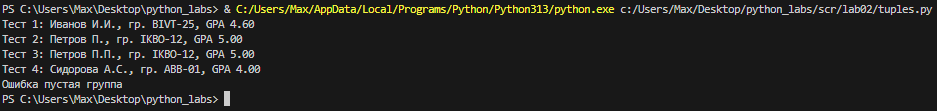
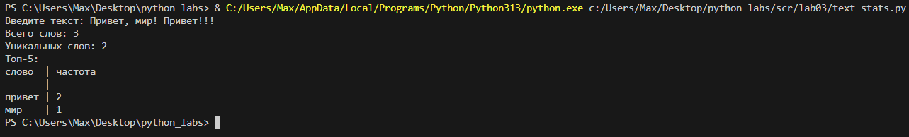

# python_labs

## Лабораторная номер 1

Задание 1
```python
print(f"Привет, {input("Имя: ")}! Через год тебе будет {int(input("Возраст: ")) + 1}.")
```


Задание 2
```python
num_1 = input()
num_1 = float(num_1.replace(",","."))
num_2 = float(input())
print(f"sum={num_1 + num_2}; avg={((num_1 + num_2)/2):.2f}")
```


Задание 3
```python
price = float(input("price= "))
discount = float(input("discount= "))
vat = float(input("vat= "))
base = price * (1 - discount/100)
vat_amount = base * (vat/100)
total = base + vat_amount
print(f"База после скидки: {base:.2f} ₽\nНДС: {vat_amount:.2f} ₽\nИтого к оплате: {total:.2f} ₽")
```


Задание 4
```python
min = int(input("Минуты: "))
print(f"{min//60}:{min%60}")
```


Задание 5
```python
name = " ".join(input("ФИО:").split())
full_name = ""
for i in name:
    if i.isupper():
        full_name += i
print(f"Инициалы: {full_name}. \nДлина (символов): {len(name)}")
```


Задание 6
```python
def solve():
    true_count = 0
    false_count = 0
    n = int(input())

    for i in range(n):
        line = input().split()
        counter = line[-1]

        if counter == "True":
            true_count += 1
        elif counter == "False":
            false_count += 1

    return print(true_count, false_count)

solve()
```


Задание 7
```python
def find_word(test):
    end = ""
    count_1 = 0
    count_2 = 0
    for i in test:
        count_1 += 1
        if i.isupper():
            end += i
            break
    
    for i in test:
        count_2 += 1
        if i.isdigit():
            break
    
    end += test[count_2::count_2 - count_1 + 1]
    return end

test = input()
print(find_word(test))
```


## Лабораторная номер 2

Задание 1
```python
def min_max(nums: list[float | int]) -> tuple[float | int, float | int]:
    """Возвращает кортеж (минимум, максимум). Если список пуст — ValueError"""
    
    if len(nums) == 0:
        raise ValueError("Список пуст")
    
    else:
        return (min(nums),max(nums))
try:
    print("min_max")
    print("Тест 1:", min_max([3, -1, 5, 5, 0]))
    print("Тест 2:", min_max([42]))
    print("Тест 3:", min_max([-5, -2, -9]))
    print("Тест 4:", min_max([1.5, 2, 2.0, -3.1]))
    print("Тест 5:", min_max([]))
except ValueError as e:
    print(f"Ошибка: {e}")


def unique_sorted(nums: list[float | int]) -> list[float | int]:
    """Возвращает отсортированный список уникальных значений (по возрастанию)"""
    return list(sorted(set(nums)))

print(f"\nunique_sorted")
print("Тест 1:", unique_sorted([3, 1, 2, 1, 3]))
print("Тест 2:", unique_sorted([]))
print("Тест 3:", unique_sorted([-1, -1, 0, 2, 2]))
print("Тест 4:", unique_sorted([1.0, 1, 2.5, 2.5, 0]))


def flatten(mat: list[list | tuple]) -> list:
    """«Расплющивает» список списков/кортежей в один список по строкам (row-major).
    Если встретилась строка/элемент, который не является списком/кортежем — TypeError"""
    result = []

    for i in mat:
        if not isinstance(i, (list, tuple)):
            raise TypeError("строка не строка строк матрицы")
        result.extend(i)    
    
    return result

try:
    print(f"\nflatten")
    print("Тест 1:", flatten([[1, 2], [3, 4]]))
    print("Тест 2:", flatten([[1, 2], (3, 4, 5)]))
    print("Тест 3:", flatten([[1], [], [2, 3]]))
    print("Тест 4:", flatten([[1, 2], "ab"]))
except TypeError as e:
    print(f"Ошибка: {e}")
```


Задание B
```python
def check_rectangular(matrix):
    """Проверяет, что матрица прямоугольная"""
    if not matrix:
        return
    first_len = len(matrix[0])
    for row in matrix:
        if len(row) != first_len:
            return False

def transpose(mat: list[list[float | int]]) -> list[list]:
    """Транспонирование матрицы (Меняем строки и столбцы местами)"""
    if check_rectangular(mat) == False:
        raise ValueError("Рваная матрица")

    if not mat:
        return []
    return [list(item) for item in zip(*mat)]

try:
    print(f"\ntranspose")    
    print("Тест 1:", transpose([[1, 2, 3]]))
    print("Тест 2:", transpose([[1], [2], [3]]))
    print("Тест 3:", transpose([[1, 2], [3, 4]]))
    print("Тест 4:", transpose([]))    
    print("Тест 5:", transpose([[1, 2], [3]])) 
except ValueError as e:
    print(f"Ошибка: {e}")

def row_sums(mat: list[list[float | int]]) -> list[float]:
    """Возвращает суммы элементов каждой строки матрицы"""
    if check_rectangular(mat) == False:
        raise ValueError("Рваная матрица")
    
    return [sum(item) for item in mat]

try:
    print(f"\nrow_sumse")    
    print("Тест 1:", row_sums([[1, 2, 3], [4, 5, 6]]))
    print("Тест 2:", row_sums([[-1, 1], [10, -10]]))
    print("Тест 3:", row_sums([[0, 0], [0, 0]]))    
    print("Тест 4:", row_sums([[1, 2], [3]])) 
except ValueError as e:
    print(f"Ошибка: {e}")

def col_sums(mat: list[list[float | int]]) -> list[float]:
    """Возвращает суммы элементов каждого столбца матрицы"""
    if check_rectangular(mat) == False:
        raise ValueError("Рваная матрица")
    
    return [sum(item) for item in zip(*mat)]

try:
    print(f"\ncol_sums")    
    print("Тест 1:", col_sums([[1, 2, 3], [4, 5, 6]]))
    print("Тест 2:", col_sums([[-1, 1], [10, -10]]))
    print("Тест 3:", col_sums([[0, 0], [0, 0]]))    
    print("Тест 4:", col_sums([[1, 2], [3]])) 
except ValueError as e:
    print(f"Ошибка: {e}")
```


Задание C
```python
def format_record(rec: tuple[str, str, float]) -> str:
    """ Форматирует запись о студенте в стандартизированную строку."""

    if not isinstance(rec, tuple):
        raise ValueError("входные данные должны быть tuple")
    elif len(rec) != 3:
        raise ValueError("tuple должен содержать ровно 3 элемента")

    result = []

    if len(rec[0]) == 0:
        raise ValueError("пустое ФИО") 
    elif len(rec[1]) == 0:
        raise ValueError("пустая группа")
    elif not isinstance(rec[2], float):
        raise ValueError("неверный тип GPA") 
    
    full_name = ((rec[0].strip()).title()).split()
    full_name_abbrevition = [str(x) for x in " ".join(full_name) if x.isupper()]
    result.append(f"{full_name[0]} {".".join(full_name_abbrevition[1:])}.")
    result.append(f"гр. {rec[1]}")
    result.append(f"GPA {rec[2]:.2f}")

    return ", ".join(result)

try:
    print("Тест 1:", format_record(("Иванов Иван Иванович", "BIVT-25", 4.6)))
    print("Тест 2:", format_record(("Петров Пётр", "IKBO-12", 5.0)))
    print("Тест 3:", format_record(("Петров Пётр Петрович", "IKBO-12", 5.0)))
    print("Тест 4:", format_record(("  сидорова  анна   сергеевна ", "ABB-01", 3.999)))
    print("Тест 5:", format_record(("сидорова  анна   сергеевна ", "", 3.999)))

except ValueError as e:
     print(f"Ошибка {e}")
```




## Лабораторная номер 3

Задание A
```python
def normalize(text: str, *, casefold: bool = True, yo2e: bool = True) -> str:
    """
    Нормализует текст путем удаления специальных символов и приведения к единому формату.
    
    Функция выполняет следующие преобразования:
    - Удаляет символы табуляции (\t) и переноса строки (\n)
    - Убирает лишние пробелы (в начале, конце и множественные внутри строки)
    - При необходимости приводит текст к нижнему регистру с использованием casefold()
    - Заменяет букву 'ё' на 'е' (опционально)

    Examples:
        normalize("ПрИвЕт\nМИр\t") == "привет мир"
        normalize("ёжик, Ёлка") == "ежик, елка"
    """

    if not isinstance(text, str):
        raise ValueError("normalize: text не str")
    
    if len(text) == 0:
        raise ValueError("normalize: пустой text")

    result = (((text.replace("\t"," ")).replace("\r"," ")).replace("\n"," "))
    result = " ".join((result.strip()).split())

    if casefold:
        result = result.casefold()

    if yo2e:
        result = result.replace('ё', 'е')

    return result

def tokenize(text: str) -> list[str]:
    """
    Функция разделяет входную строку на части, используя в качестве разделителей
    любые символы, которые не являются буквами или цифрами.

    Examples:
        tokenize("привет, мир!") == ["привет", "мир"]
        tokenize("по-настоящему круто") == ["по-настоящему", "круто"]
        tokenize("2025 год") == ["2025", "год"]
    """
    import re

    if not isinstance(text, str):
        raise ValueError("tokenize: text не str")
    
    if len(text) == 0:
        raise ValueError("tokenize: пустой text")
    
    split_result = re.split(r"[^\w-]+", text)
    
    return [item for item in split_result if len(item) >= 1]
    

def count_freq(tokens: list[str]) -> dict[str, int]:
    """
    Подсчитывает частоту встречаемости слов в списке токенов.

    Examples:
        count_freq(["a","b","a","c","b","a"]) == {"a":3, "b":2, "c":1}
        count_freq(["bb","aa","bb","aa","cc"]) == {"aa":2, "bb":2, "cc":1}
    """
    from collections import Counter

    if not isinstance(tokens, list):
        raise ValueError("tokenize: text не str")
    
    if len(tokens) == 0:
        raise ValueError("count_freq: пустой tokens")

    return dict(sorted(Counter(tokens).items(), key=lambda item: (-item[1], item[0])))

def top_n(freq: dict[str, int], n: int = 5) -> list[tuple[str, int]]:
    """
    Возвращает топ-N самых частых слов с сортировкой по убыванию частоты.

    Examples:
        top_n({"a":3, "b":2, "c":1}, 2) == [("a",3), ("b",2)]
        top_n({"aa":2, "bb":2, "cc":1}, 2) == [("aa",2), ("bb",2)]
    """

    if not isinstance(freq, dict):
        raise ValueError("top_n: freq не  dict")
    
    if len(freq) == 0:
        raise ValueError("top_n: пустой freq")
    
    return sorted(freq.items(), key=lambda item: (-item[1], item[0]))[:n]
```


Задание B★
```python
import sys
import os
sys.path.append(os.path.join(os.path.dirname(__file__), '..'))

from lib.text import *

# Флаг для включения/выключения табличного режима
# True - табличный вывод, False - простой список
TABLE_MODE = True

def print_table(words_data: list[tuple[str, int]]) -> None:
    """
    Выводит форматированную таблицу слов и их частот в отсортированном виде.
    
    Функция принимает список кортежей (слово, частота) и выводит их в виде
    читаемой таблицы с выравниванием колонок. Ширина первой колонки автоматически
    подстраивается под самое длинное слово в данных или заголовке.
    """
    if not words_data:
        raise ValueError("print_table: words_data пуст")
    
    max_word_length = max(len(word) for word, count in words_data)

    if len("слово") > max_word_length:
        max_word_length = len("слово")
    
    print(f"{'слово':<{max_word_length}} | частота")
    print("-" * max_word_length + "-|-" + "-" * 7)
    
    for word, count in words_data:
        print(f"{word:<{max_word_length}} | {count}")

def print_simple(words_data: list[tuple[str, int]]) -> None:
    """
    Выводит список слов и их частот в простом формате.
    
    Функция принимает список кортежей (слово, частота) и выводит их
    в виде простого списка без форматирования таблицы.
    """
    if not words_data:
        raise ValueError("print_simple: words_data пуст")
    
    for word, count in words_data:
        print(f"{word}: {count}")

try:
    inpt_text = input("Введите текст: ")
    normalize_text = normalize(inpt_text)
    tokens = tokenize(normalize_text)
    freq = count_freq(tokens)
    top_words = top_n(freq, 5)

    print(f"Всего слов: {len(tokens)}")
    print(f"Уникальных слов: {len(freq)}")

    print("Топ-5:")
    if TABLE_MODE:
        print_table(top_words)
    else:
        print_simple(top_words)

except ValueError as e:
    print(f"Ошибка: {e}")
```

