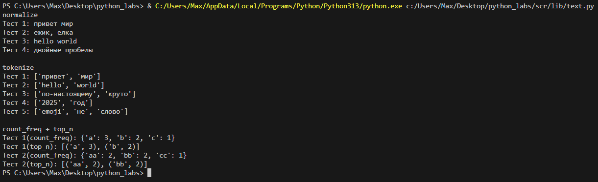
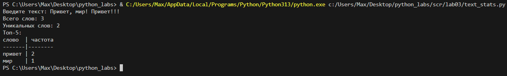

# Лабораторная работа 3: Статистический анализ текста

## Реализованные функций

### 1. normalize(text)
- Нормализует текст: удаляет спецсимволы, приводит к нижнему регистру
- Заменяет букву "ё" на "е"
- Возвращает очищенную строку

```python
def normalize(text: str, *, casefold: bool = True, yo2e: bool = True) -> str:
    """
    Нормализует текст путем удаления специальных символов и приведения к единому формату.
    
    Функция выполняет следующие преобразования:
    - Удаляет символы табуляции (\t) и переноса строки (\n)
    - Убирает лишние пробелы (в начале, конце и множественные внутри строки)
    - При необходимости приводит текст к нижнему регистру с использованием casefold()
    - Заменяет букву 'ё' на 'е' (опционально)

    Examples:
        normalize("ПрИвЕт\nМИр\t") == "привет мир"
        normalize("ёжик, Ёлка") == "ежик, елка"
    """

    if not isinstance(text, str):
        raise ValueError("normalize: text не str")
    
    if len(text) == 0:
        raise ValueError("normalize: пустой text")

    result = (((text.replace("\t"," ")).replace("\r"," ")).replace("\n"," "))
    result = " ".join((result.strip()).split())

    if casefold:
        result = result.casefold()

    if yo2e:
        result = result.replace('ё', 'е')

    return result
```

### 2. tokenize(text)  
- Разделяет текст на слова (токены)
- Использует не-буквенно-цифровые символы как разделители
- Сохраняет слова с дефисами

```python
def tokenize(text: str) -> list[str]:
    """
    Функция разделяет входную строку на части, используя в качестве разделителей
    любые символы, которые не являются буквами или цифрами.

    Examples:
        tokenize("привет, мир!") == ["привет", "мир"]
        tokenize("по-настоящему круто") == ["по-настоящему", "круто"]
        tokenize("2025 год") == ["2025", "год"]
    """
    import re

    if not isinstance(text, str):
        raise ValueError("tokenize: text не str")
    
    if len(text) == 0:
        raise ValueError("tokenize: пустой text")
    
    split_result = re.split(r"[^\w-]+", text)
    
    return [item for item in split_result if len(item) >= 1]
```

### 3. count_freq(tokens)
- Подсчитывает частоту каждого слова
- Возвращает словарь {слово: количество}

```python
def count_freq(tokens: list[str]) -> dict[str, int]:
    """
    Подсчитывает частоту встречаемости слов в списке токенов.

    Examples:
        count_freq(["a","b","a","c","b","a"]) == {"a":3, "b":2, "c":1}
        count_freq(["bb","aa","bb","aa","cc"]) == {"aa":2, "bb":2, "cc":1}
    """
    from collections import Counter

    if not isinstance(tokens, list):
        raise ValueError("tokenize: text не str")
    
    if len(tokens) == 0:
        raise ValueError("count_freq: пустой tokens")

    return dict(sorted(Counter(tokens).items(), key=lambda item: (-item[1], item[0])))
```

### 4. top_n(freq, n)
- Возвращает N самых частых слов
- Сортировка по убыванию частоты, при равенстве - по алфавиту

```python
def top_n(freq: dict[str, int], n: int = 5) -> list[tuple[str, int]]:
    """
    Возвращает топ-N самых частых слов с сортировкой по убыванию частоты.

    Examples:
        top_n({"a":3, "b":2, "c":1}, 2) == [("a",3), ("b",2)]
        top_n({"aa":2, "bb":2, "cc":1}, 2) == [("aa",2), ("bb",2)]
    """

    if not isinstance(freq, dict):
        raise ValueError("top_n: freq не  dict")
    
    if len(freq) == 0:
        raise ValueError("top_n: пустой freq")
    
    return sorted(freq.items(), key=lambda item: (-item[1], item[0]))[:n]
```

## Тест-кейсы

### in
```python
try:
    print("normalize")
    print("Тест 1:", normalize("ПрИвЕт\nМИр\t"))
    print("Тест 2:", normalize("ёжик, Ёлка", yo2e=True))
    print("Тест 3:", normalize("Hello\r\nWorld"))
    print("Тест 4:", normalize("  двойные   пробелы  "))

    print("\ntokenize")
    print("Тест 1:", tokenize("привет мир"))
    print("Тест 2:", tokenize("hello,world!!!"))
    print("Тест 3:", tokenize("по-настоящему круто"))
    print("Тест 4:", tokenize("2025 год"))
    print("Тест 5:", tokenize("emoji 😀 не слово"))

    print("\ncount_freq + top_n")
    print("Тест 1(count_freq):", count_freq(["a","b","a","c","b","a"]))
    print("Тест 2(top_n):", top_n(count_freq(["a","b","a","c","b","a"]), n=2))
    print("Тест 3(count_freq):", count_freq(["bb","aa","bb","aa","cc"]))
    print("Тест 4(top_n):", top_n(count_freq(["bb","aa","bb","aa","cc"]), n=2))
except ValueError as e:
    print(f"Ошибка: {e}")
```

### out


## Задание B★ - Интерактивная программа

### Описание
Создана интерактивная программа для анализа текста, которая:
- Принимает текст от пользователя
- Нормализует его с помощью функции `normalize()`
- Разбивает на токены с помощью `tokenize()`
- Подсчитывает частоту слов через `count_freq()`
- Выводит топ-5 самых частых слов в виде красивой таблицы

### Код программы
```python
import sys
import os
sys.path.append(os.path.join(os.path.dirname(__file__), '..'))

from lib.text import *

def print_table(words_data: list[tuple[str, int]]) -> None:
    """
    Выводит форматированную таблицу слов и их частот в отсортированном виде.
    
    Функция принимает список кортежей (слово, частота) и выводит их в виде
    читаемой таблицы с выравниванием колонок. Ширина первой колонки автоматически
    подстраивается под самое длинное слово в данных или заголовке.
    """
    if not words_data:
        raise ValueError("print_table: words_data пуст")
    
    max_word_length = max(len(word) for word, count in words_data)

    if len("слово") > max_word_length:
        max_word_length = len("слово")
    
    print(f"{'слово':<{max_word_length}} | частота")
    print("-" * max_word_length + "-|-" + "-" * 7)
    
    for word, count in words_data:
        print(f"{word:<{max_word_length}} | {count}")

def print_simple(words_data: list[tuple[str, int]]) -> None:
    """
    Выводит список слов и их частот в простом формате.
    
    Функция принимает список кортежей (слово, частота) и выводит их
    в виде простого списка без форматирования таблицы.
    """
    if not words_data:
        raise ValueError("print_simple: words_data пуст")
    
    for word, count in words_data:
        print(f"{word}: {count}")

try:
    inpt_text = input("Введите текст: ")
    normalize_text = normalize(inpt_text)
    tokens = tokenize(normalize_text)
    freq = count_freq(tokens)
    top_words = top_n(freq, 5)

    print(f"Всего слов: {len(tokens)}")
    print(f"Уникальных слов: {len(freq)}")

    print("Топ-5:")
    if TABLE_MODE:
        print_table(top_words)
    else:
        print_simple(top_words)

except ValueError as e:
    print(f"Ошибка: {e}")
```

### Пример работы программы


## Дополнительная функциональность - Режимы вывода

### Описание
Программа поддерживает два режима вывода результатов анализа текста:

1. **Табличный режим** (`TABLE_MODE = True`) - красивый форматированный вывод в виде таблицы с выравниванием колонок
2. **Простой режим** (`TABLE_MODE = False`) - простой список в формате "слово: количество"

```python
# Для табличного режима:
TABLE_MODE = True

# Для простого режима:
TABLE_MODE = False
```

### Примеры вывода

**Табличный режим:**
```
слово  | частота
-------|--------
привет | 3
мир    | 2
python | 1
```

**Простой режим:**
```
привет: 3
мир: 2
python: 1
```

## Анализ и выводы

### Что было реализовано:
1. **Функция `normalize()`** - успешно нормализует текст, убирая лишние символы и приводя к единому формату
2. **Функция `tokenize()`** - корректно разбивает текст на слова, сохраняя слова с дефисами
3. **Функция `count_freq()`** - точно подсчитывает частоту слов и сортирует по убыванию
4. **Функция `top_n()`** - возвращает нужное количество самых частых слов
5. **Интерактивная программа** - создает удобный интерфейс для анализа текста
6. **Система режимов вывода** - добавлен флаг `TABLE_MODE` для переключения между табличным и простым режимами
7. **Функция `print_simple()`** - выводит результаты в простом формате без табличного форматирования

### Особенности реализации:
- Все функции имеют проверку входных данных и выдают понятные ошибки
- Используется `casefold()` для корректного приведения к нижнему регистру
- Регулярные выражения для токенизации текста: `r"[^\w-]+"`
  - `r` - raw string (сырая строка), отключает обработку escape-последовательностей (`\n`,`\t` и другие)
  - `[^\w-]` - символы, которые НЕ являются буквами, цифрами, подчеркиванием или дефисом
  - `+` - один или более таких символов подряд
- Динамический импорт модулей: `sys.path.append(os.path.join(os.path.dirname(__file__), '..'))`
  - `sys.path.append()` - добавляет путь к списку путей для поиска модулей
  - `os.path.dirname(__file__)` - получает папку текущего файла
  - `os.path.join(..., '..')` - поднимается на уровень выше для доступа к папке `lib`
  - Позволяет импортировать функции из `lib.text` модуля
- **Система флагов для управления выводом:**
  - Константа `TABLE_MODE` позволяет переключать режимы вывода
  - Условный оператор `if-else` выбирает нужную функцию вывода
- Автоматическое форматирование таблицы результатов
- Обработка исключений в интерактивной программе

### Тестирование:
- Все функции протестированы на различных входных данных
- Проверена работа с пустыми строками и некорректными типами данных